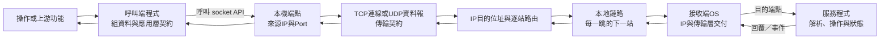

# 從熟悉概念到讀懂通訊程式：課程架構

更新日期：2026-10-05。此版取代前一份把使用者當成從入門名詞起步、並規劃四套共同基礎系列的草案。課程目標不變，教學起點修正後，範圍也隨之收斂。

## 誰在學、要補什麼

使用者是新進軟體工程師，曾學一般資工系課程的常見概念，大致理解原理。IP、Port、TCP／UDP、Socket也曾學過，對單一概念有概念，主要缺口在概念如何接成一條資料流程，以及怎麼連到實際程式、封包和除錯。二進位轉換大致會，需看到它如何用在byte、編碼或工具資料；C#不熟，稍懂C++，if／else和迴圈能作為參照。

所以，教材以概念熟悉者能跟上的工程說明為預設。工作是說清楚相鄰角色怎麼交接、每個資訊被誰使用、哪項證據能判斷流程到了哪裡。除非後文實際需要，否則不重講二進位位值、迴圈、作業系統定義或名詞百科。需要補深度時，從本次程式或資料推導，不以抽象比喻代替。

成功的學習結果是遇到熟悉名詞不只想得起定義，還能把一個實際操作放進全程：資料在誰手上、程式如何交給系統、系統如何送到目標、對方如何取得及處理、什麼證據能區分路徑上的問題，以及修正後如何驗收。這支援使用者自己的工作；不宣稱完成課程即可獨立維護任何未知公司系統。

## 一次請求的共用參照圖

先以一個明確的狀態查詢當示意，讓既有概念出現在同一條路徑上。圖是閱讀程式和證據時的參照座標，不代表公司一定採用HTTP、TCP或這個部署方式；如個案路徑不同，要按實際程式及文件更換。

圖上每一個箭頭代表交接，不只是「走過某一層」：應用程式交資料給本機通訊介面，核心的網路功能加上收送資訊，沿著下一站前進，接收端再選中相應連線與程式。TCP將應用交來的byte stream分段後傳送，還原的byte stream不保留每次`Send`的訊息界線；應用層協定仍需定義如何分辨一則訊息何時完整。IP決定網路間的去向，本地鏈路只負責本次連接的下一站。回程通常從回覆程式開始，網路可能選另一條路；它不必逐跳照原路倒回。

這些是接資料的順序，不是所有實作的層級清單。實際觀測如Wireshark的link-layer frame、IP packet、TCP segment與重組後的stream，對應不同交接位置。若TCP ACK已到，只能支持傳輸端點收到了相應序號範圍，不能單憑它證明服務程式已讀取、商業操作已成功或呼叫端已顯示。每一個結論要跟可觀測位置相稱。

## 範圍：個人知識庫，不是再上一遍資工學院

16個入口的保留理由，是使用者已點名或長期學習會用到不同領域。它們互相獨立，可依工作選讀；不把16個入口全部列為必修，也不要求每個領域都補成百科或同樣長。入口之外的連接部分負責帶出本主題必要前置，較遠的原理放在可選參照。

| 領域 | 學習者需要帶走的實務模型 | 範圍界線 |
| --- | --- | --- |
| 電腦網路、Socket、Wireshark | 把服務呼叫、端點、TCP／UDP、IP路徑、本地交付、重組資料及程式回應接成一條路；能將程式行為對照封包證據。 | 地址、TCP、UDP等不再各教成彼此孤立名詞；詳細協定、篩選語法及傳輸數學在任務需要時深入。 |
| Ozeki API、ICS／RCS與廠商API | 以實際版本的文件和程式追一個呼叫、物件、事件與釋放生命週期，弄清SDK與本地包裝程式的責任。 | 不推測未取得的公司DLL、包裝層或部署圖；沒有對應來源的行為明確列為未知。 |
| PTT／設備狀態、RS-232、無線電 | 分清軟體命令、狀態回報、資料格式和設備介面的邊界，追一個正常控制及回報，再定位軟體能觀察到的差異。 | 硬體角色、方向、條件及訊號只講到支援軟體維護；不教電路／天線設計、鏈路預算或硬體公式。 |
| VoIP與聲音、DSP／SDR、衛星多鏈路 | 沿控制與媒體資料的來源、格式、處理／傳輸狀態，到接收、播放及切換後續接，能讀軟體使用的速率與品質證據。 | 不要求複數傅立葉手算、完整Codec百科、軌道或RF設計；必要資料量與時間關係用現場數值說明。 |
| 可靠性／並行、Windows／Linux觀測、通訊資安 | 把等待、資源、服務身分、授權、憑證、取消、錯誤和紀錄對到眼前操作與程式生命週期。 | 只展開會影響此處行為的OS及安全細節；不另寫全套OS或密碼學課程。 |
| 故障分析、概念整理 | 讓證據縮小可能位置、核對原本流程，完成範圍明確的修正及回歸測試；能整理已知與未知。 | 當成跨主題的使用方法和案例入口，不另造一套龐大的虛構公司系統。 |

本輪確認的六個核心系列為 Ozeki／ICS、PTT、VoIP、無線電、廠商 API、可靠性，已完成 50 篇新版教材。最初估算約四十篇；逐篇按需要教會的維護任務核對後，實際需要 50 篇。各系列作者與獨立審查檢查相鄰章節是否教同一任務，目前未發現應只為符合估量而合併的內容。電腦網路、Wireshark、Socket與RS-232另有28篇可跳讀的新版參照。網站其餘 Windows／Linux 觀測、衛星、多鏈路、DSP／SDR、資安、通用故障分析和概念地圖仍保留入口，但其48篇未改版內容不宣稱符合新版深度，也不列入這次完成範圍。篇數用來描述範圍，不當成內容品質或學習成效。

Ozeki系列的目標已進一步確認為本機音訊控制：由程式選擇麥克風／喇叭，追蹤媒體來源、處理或串接、錄音與播放的生命週期；SIP／RTP只在音訊進出通話時作為邊界說明，不當作主體。使用者提供的筆記提及 `Softphone`、`PhoneCall`、SIP/RTP 和本機麥克風／喇叭，但實際公司 SDK 版本與 ICS 包裝呼叫仍需原始碼和版本文件驗證。通用廠商 API 系列則聚焦如何讀版本匹配的 API／ICD、呼叫與事件、錯誤和資源契約，不預設未知廠商行為。

六系列之間採以下責任邊界，以免把相鄰主題寫成重複的協定百科：

| 系列 | 主問題 | 不重教的相鄰責任 |
| --- | --- | --- |
| Ozeki／ICS | 本機媒體來源與接收端如何由 SDK 串接、控制及釋放；公司包裝層需沿實際程式查證。 | SIP／RTP格式與封包判讀交 VoIP／Wireshark；PTT授權交 PTT。 |
| PTT | 一次發話意圖如何通過准入、設備控制和停止流程；每個狀態由誰回報。 | 麥克風與喇叭媒體處理交 Ozeki；RF傳播與品質數值交無線電。 |
| VoIP | SIP呼叫控制、SDP端點協商、RTP媒體序列與音質問題如何接續。 | UI／公司 wrapper 生命週期交 ICS；抓包操作與具體 dissector 交 Wireshark。 |
| 無線電 | 從調變資料、收發方向到設備可回報的鏈路品質，定位通訊路徑。 | 本機聲卡 API 交 Ozeki；按鍵／授權狀態交 PTT；天線與電路設計不在範圍。 |
| 廠商 API | 依相符版本文件讀呼叫、回傳、事件、錯誤與資源所有權。 | 只用一個具體功能作練習，不另教 Ozeki媒體或SIP協定。 |
| 可靠性 | 以期限、重試、重連、佇列、並行和執行順序分析長時間運作問題。 | 不取代前五系列各自的 API 或無線電機制教學；案例須回到已確認的邊界。 |

## 共同基礎如何補，才不重開四套課

過去規劃的C#、位元資料、作業系統、數量與圖表四個「完整共通系列」取消。它們改成精簡的按需參照：

- **C#閱讀**：第一次遇到公司程式的`event`、`Task`／`await`、`Dispose`、例外或取消，只說明該語法與目前流程的關係，連到一個短參照。不要每個主題重教變數、迴圈或整套物件導向課程。
- **bytes與表示**：有封包原始值時說清楚編碼、位元組長度和訊息邊界；已有二進位轉換能力，直接對照工具輸出。只有讀者卡住時才提供手算複習。
- **程序與作業系統**：在socket或服務例子中辨認使用它的程式、OS介面、程序和端點；不另寫程序排程、記憶體管理或核心設計概論。
- **計量和圖表**：在頻寬、buffer、時間線或DSP資料遇到實際數量時計算並解釋單位，不預設欠缺函數或比例概念。

每篇只連到當前推理所需的確切參照位置與返回位置。若一個讀者能用現有概念完成本篇任務，就不會因所有人都有共同起點而被要求讀完整基礎系列。

## Socket 主題的內部分工

Socket 八篇新版已各自對應不同的程式維護任務，不用篇幅重複教通用名詞。以下是建議閱讀順序和篇章責任，不是必須依序完成的相依鏈：

| 篇章 | 本篇要讓讀者能做的事 | 與相鄰篇的界線 |
| --- | --- | --- |
| `socket-flow` | 從 C# 呼叫追到本機端點、listener、`Accept` 產生的新 socket、每條連線的所有者與釋放時機。 | 網路主題已建立端到端路徑；DNS、IP家族與路由留在網路篇，本篇只補讀懂程式物件所需的端點背景。 |
| `tcp-udp-apis` | 對照 `Socket`、`TcpClient`／`NetworkStream`、`UdpClient` 的收送參數、返回值、EOF／空資料報、來源資訊和關閉責任。 | `networking--tcp-udp` 已說明傳輸模型；本篇聚焦 .NET 包裝 API 如何映射到程式行為，不重教協定取捨、MTU或壅塞。 |
| `message-boundaries` | 維護跨多次讀取的 TCP 框架解析器，追蹤部分標頭、部分本文、連續多框、EOF、取消及長度上限。 | 聚焦串流上的訊息完整性，不在此重教所有二進位欄位編碼。 |
| `binary-protocols` | 依格式定義把已取得的 bytes 解成欄位，核對偏移、位元組順序、字串編碼、單位與格式／語意驗證。 | 聚焦欄位的表示和驗證；框架如何跨多次讀取取得完整訊息，連回 `message-boundaries`。 |
| `timeouts-and-readiness` | 以常見 async／await 程式追蹤取消、遲到結果與單次讀取期限如何受整筆請求期限限制。 | 主線採 .NET 非同步呼叫與期限；`Poll`／`Select`／就緒迴圈列為按需選讀。只回答「何時再試、等到何時」；取消後狀態怎麼恢復連回下一篇。 |
| `disconnect-and-reconnect` | 分辨 FIN／RST／逾時／本機取消等不同結束，處理結果未知的命令，並讓新連線重新同步狀態。 | 著重會話更換後的業務一致性，不重講等待機制。 |
| `logs-and-debugging` | 為既有通訊流程建立 request／connection／operation 關聯，判斷每筆紀錄能證明哪個交接已發生。 | 交付物是證據鏈及其盲點，不在此代替故障案例做根因結論。 |
| `socket-troubleshooting` | 讀一份既有程式和跨層觀測，找出最早不符合預期的交接、提出可反駁假說、選有限修正並設計回歸驗收。 | 作為整合診斷篇；把前面工具用於完整案例，不再逐一重教日誌欄位或框架演算法。 |

寫作與審查時要避免兩種假完整：把 TCP 的每次 `Receive` 當成一則完整訊息，或把「Socket API 呼叫成功」等同遠端業務操作成功。前者由框架章用逐步 buffer 狀態說明；後者由正常路徑及故障案例標清每個證據邊界。每篇若需要共同前置，只連到能補足該篇任務的段落，不把八篇綁成唯一線性必修。

## RS-232 主題的內部路徑

RS-232主線先把呼叫端、串列API、UART字元、設備訊息和回覆串成一次完整交易，再逐步看有效設定、解析邊界、實際讀取與故障證據。建議閱讀路徑為 `serial-layers` → `uart-settings` → `frame-and-timing` → `tools-and-loopback` → `serial-troubleshooting`；這是幫助建立流程的順序，各篇仍可獨立查閱。`electrical-and-wiring` 只在疑點落到轉接器、線路介面或控制線時選讀，`other-interfaces` 只在現有程式真的使用 RS-485、SPI、I²C 或串列網路橋時選讀。後兩篇協助讀型號文件、理解軟體可見的介面責任與觀測範圍，不要求電路設計或硬體公式。

改寫保留穩定章節 ID。所有 Device-Lab-A 查詢使用同一組 9600 8N1、9-byte請求、10-byte回覆及 20ms裝置處理假設；交易下界因此一致為 39.7917ms。自製協議與 .NET 10 模型清楚標示為教學材料，不能代替公司設備文件或實際線路觀測。

## 寫作形狀和停止條件

每篇以一條有工程價值的正常路徑開場；選用真實協定、文件或程式片段，或明確標示教學抽象。圖上要能追呼叫者、資料、交接、狀態與回覆。名詞可以直接用技術名稱，首次出場用流程解釋該概念在這裡負責什麼；不逐字介紹讀者已知的課本定義。完成全流程後，才挑一個能區分原因的條件變化或實際維護案例。

一節不能只為了「循序」而把同一流程再講一次。一個流程、一張有用途的圖、一項或數項貼合的例子和足以確認推理的練習即可；是否需要更多，由本篇的知識缺口決定。篇幅、節數、例題、練習和預估時間均由教學需要決定，無固定下限或套版。刪除重複的角色自介、比喻、換句話說、事後重述和不改變推理的角色戲碼；保留編碼／資料值／應用意義等必要區分。

不要假設實際公司使用圖上的protocol、線路、順序或API。教學推演只負責說清一般責任與條件，需映射公司程式時必須以實際文件、版本、程式碼和授權證據重建路徑。新教材不能把「工具顯示送達」或「TCP有ACK」寫成公司功能成功。

## 如何審查是否合適

作者、獨立技術審查與讀者起點檢視各自負責技術正確、前後責任是否接得上，以及內容是否重教。整合者全文通讀並檢查圖文導航。最重要的人工驗收是：讀者看同一條流程，能指出目前資料在哪個位置、某份證據到底代表誰已完成什麼。題數、章數、文字長度或網站測試都不能單獨證明讀者可維護系統。

本次完成78篇新版教材：28篇網路、Wireshark、Socket及RS-232參照，加上六核心系列50篇。技術和銜接審查的修正與驗收證據，分列於[改版紀錄](README.md)和各系列紀錄。網站互動、126篇結構及教學PCAP的重跑結果見[verification.json](verification.json)。目前環境沒有Playwright／Chromium、Wireshark／TShark或可用的.NET SDK，因此本輪沒有宣稱已驗證瀏覽器畫面、原生Wireshark視圖或C#專案重建；使用者本人也尚未試讀。公開頁面驗證另列於[publication-verification.json](publication-verification.json)。尚未改版的48篇保留為舊版參考資料，是否改寫應由後續學習需求決定。
